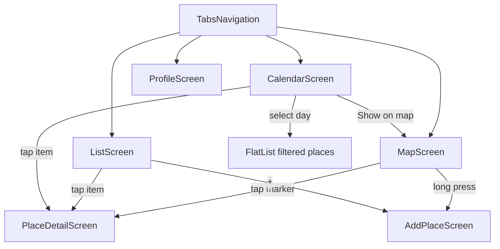
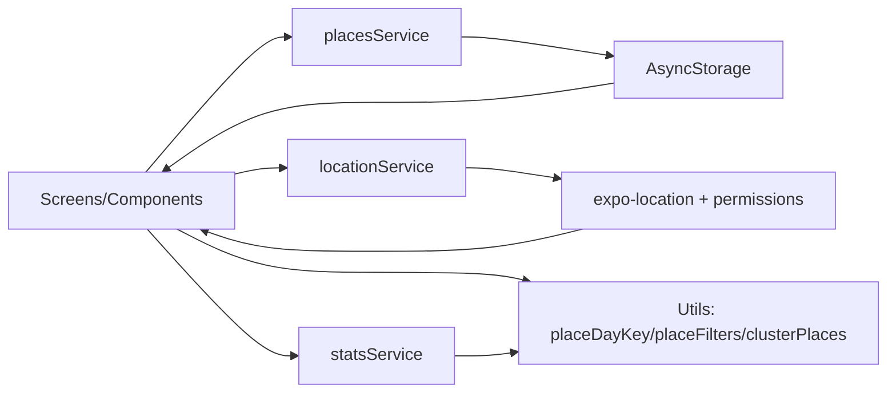

## City Explorer Lite

### 1) Pitch & User Stories

City Explorer Lite est une application mobile (Expo / React Native) pour enregistrer des lieux visités (photo, tags, date), les afficher sur une carte, filtrer par date via calendrier, et consulter des statistiques.

- Ajouter un lieu avec nom, description, tags, date et photo
- Voir les lieux sur une carte avec marqueurs + position utilisateur
- Appui long sur la carte pour créer un lieu (coordonnées pré-remplies)
- Filtrer par date via calendrier et afficher la liste filtrée
- Consulter un profil avec statistiques (total lieux, jour le plus actif, top tags)

### 2) Stack & pré-requis

- Expo SDK 54
- React 19 / React Native 0.81 (JSX)
- React Navigation (tabs + stack)
- AsyncStorage (`@react-native-async-storage/async-storage`)
- Map: `react-native-maps`
- Location: `expo-location`
- Calendar: `react-native-calendars`
- Photos: `expo-image-picker` + `expo-media-library`
- Web (optionnel): `react-dom` + `react-native-web`

Pré-requis:
- Node.js + npm
- Expo Go sur mobile (même réseau que le PC)
- Autoriser permissions GPS / caméra / galerie

### 3) Installation & run (dev, mock API, build)

Dev:
- Installer les dépendances (npm ou yarn)
- Lancer Expo en mode dev
- Ouvrir l’app dans Expo Go via QR code

Mock API:
- Pas d’API distante; les lieux sont stockés localement via AsyncStorage (`services/placesService.js`)

Build:
- Build via workflow Expo (EAS) si demandé; sinon Expo Go suffit pour la démo

### 4) Architecture (schémas inclus)

Navigation (tabs/stacks/flux):

Services & dataflow (offline + erreurs):

### 5) Modèle de données (entité principale + attributs)

Entité principale: `Place` (Variant A)

- `id`: string
- `name`: string
- `description`: string
- `tags`: string[]
- `date`: string (saisie “JJ/MM/AAAA”; normalisée en “YYYY-MM-DD” pour calendrier/stats via `placeDayKey`)
- `imageUri`: string | null
- `isFavorite`: boolean
- `latitude`: number | undefined
- `longitude`: number | undefined
- `createdAt`: string (ISO)

Stockage: tableau de `Place` sauvegardé en AsyncStorage.

### 6) Fonctionnalités livrées (checklist)

- [x] Tabs: Map / List / Calendar / Profile
- [x] Stockage local des lieux (AsyncStorage)
- [x] Ajout d’un lieu (form) + sauvegarde locale
- [x] Photo: galerie + caméra
- [x] Map: markers + position utilisateur
- [x] Tap marker → détail
- [x] Long press map → ajout (coordonnées pré-remplies)
- [x] Filtres Map (tags/favoris/jour) via params
- [x] Clustering markers (JS)
- [x] Calendar: points sur jours avec lieux + sélection d’un jour
- [x] Calendar: liste filtrée (FlatList) des lieux du jour
- [x] Profile: profil complet + stats simples (total lieux, jour le plus actif, top tags)

### 7) Sécurité & confidentialité (permissions, .env)

Permissions:
- Localisation: affichage position / centrage map
- Caméra / Galerie: ajout de photo à un lieu

Confidentialité:
- Données stockées localement (AsyncStorage), pas de backend
- Photo stockée via `imageUri` (pas d’upload)

.env:
- Pas d’API key actuellement
- Si ajout plus tard: ne jamais versionner `.env`

### 8) Répartition des tâches (tableau)

| Membre | Tâches principales | Fichiers clés |
|---|---|---|
| Wael | Map, filtres, clustering, services, routing | `screens/MapScreen.jsx`, `components/PlacesMapView.jsx`, `services/*` |
| Nassim | List UI, PlaceItem, styles | `screens/ListScreen.jsx`, `components/PlaceItem.jsx`, `styles/styles.js` |
| Équipe | Calendar + Profile + intégration | `screens/CalendarScreen.jsx`, `screens/ProfileScreen.jsx` |

### 9) Captures d'écran (≥ 5)

À inclure:
- Map (markers + position)
- AddPlace (form + preview photo)
- List (filtres + liste)
- PlaceDetail (détail + delete)
- Calendar (jours marqués + liste filtrée)
- Profile (header + tiles + stats cards + top tags)